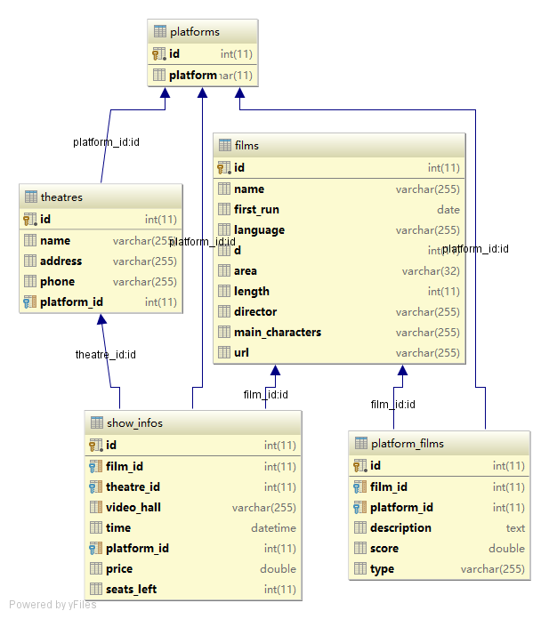
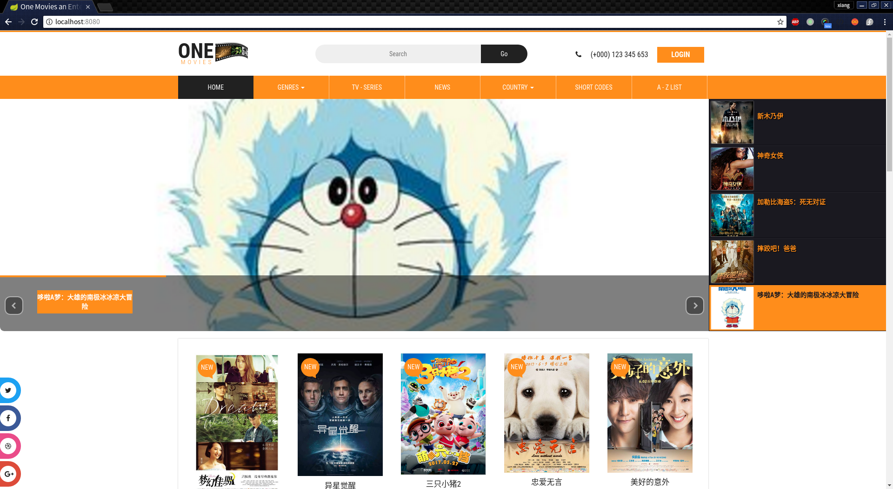
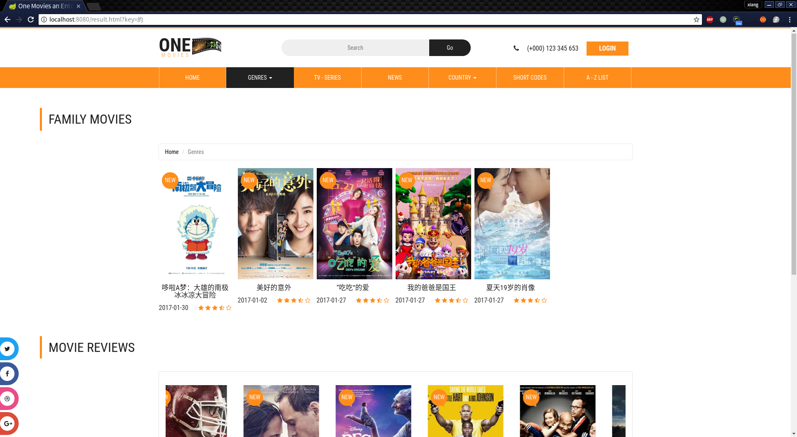
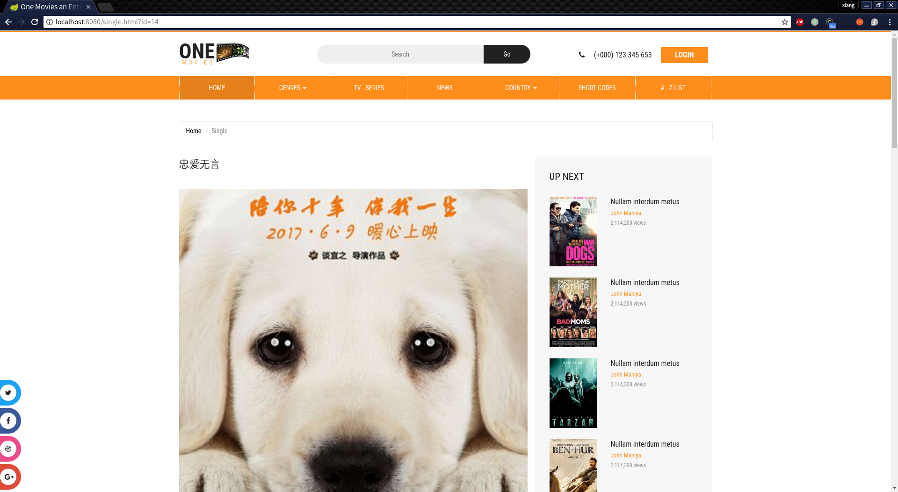
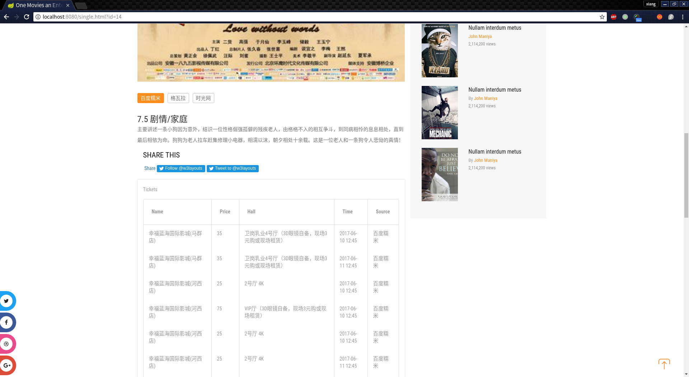

# 应用集成原理与工具
*作业二报告*
## 选题

本次我们选择了主题二并结合当下比较流行的电影为背景，进行数据的获取、集成和展示的实验。这次的文档也依照获取、集成、和展示的顺序来介绍我们所做的工作

## 数据获取

我们采用自己设计的爬虫程序来获取数据，最终成功了集成了[百度糯米]()、[格瓦拉]()、[时光网]()三个平台的热映电影、影院、票务和放映场次三方面的信息来作为我们的数据集

## 数据集成

我们采用统一的数据库来存储三个来源的信息，并在行中区别平台。采用影院、电影、平台三个主要的实体以及平台-电影（不同平台对于同一个电影的描述）、影院-电影-平台（影院放映的电影场次和在不同平台上面的售价）两个关系表来集成数据

数据库E-R设计图如下所示

存储数据展示

电影

影院

电影-平台的介绍

放映场次

## 数据展示

采用spring boot等一系列框架作为基本的web项目，采用了restful接口和vue.js框架进行展示

提供以下功能：

* 主页上最新上映电影展示
* 根据电影名搜索电影以及搜索结果展示
* 电影详细信息、评分展示（区分平台）
* 电影放映场次、票价、影城信息展示（区分平台）

运行截图

主页(会动态展示最新的电影)

搜索页面

电影详情页(电影名称、海报)

电影评分标签和介绍

电影放映场次

## 总结

通过这次作业，我们学习了如何在网络上获取数据和集成不同来源的数据，最重要的是如何处理数据不一致和不匹配等比较麻烦的问题，可以说是收获颇丰

同时，也为下一次的作业打下了基础，更加深刻地认识到了应用集成的重要性

小组成员

* 程翔   141250018
* 陈之威 141250016
* 崔浩   141250019
* 陈天歌 141250014 
* 陈丹妮 141250008