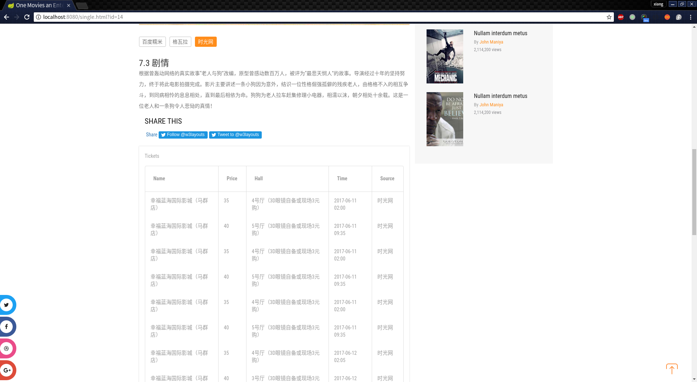

# 应用集成原理与工具
*作业二报告*
## 选题

本次我们选择了主题二并结合当下比较流行的电影为背景，进行数据的获取、集成和展示的实验。这次的文档也依照获取、集成、和展示的顺序来介绍我们所做的工作

## 数据获取

我们采用自己设计的爬虫程序来获取数据，最终成功了集成了[百度糯米]()、[格瓦拉]()、[时光网]()三个平台的热映电影、影院、票务和放映场次三方面的信息来作为我们的数据集

## 数据集成

我们采用统一的数据库来存储三个来源的信息，并在行中区别平台。采用影院、电影、平台三个主要的实体以及平台-电影（不同平台对于同一个电影的描述）、影院-电影-平台（影院放映的电影场次和在不同平台上面的售价）两个关系表来集成数据

数据库E-R设计图如下所示

存储数据展示

电影

影院

电影-平台的介绍

放映场次

## 数据展示

采用spring boot等一系列框架作为基本的web项目，采用了restful接口和vue.js框架进行展示

提供以下功能：

* 主页上最新上映电影展示
* 根据电影名搜索电影以及搜索结果展示
* 电影详细信息、评分展示（区分平台）
* 电影放映场次、票价、影城信息展示（区分平台）

运行截图

主页(会动态展示最新的电影)

搜索页面

电影详情页(电影名称、海报)

电影评分标签和介绍

电影放映场次

## 总结

通过这次作业，我们学习了如何在网络上获取数据和集成不同来源的数据，最重要的是如何处理数据不一致和不匹配等比较麻烦的问题，可以说是收获颇丰

同时，也为下一次的作业打下了基础，更加深刻地认识到了应用集成的重要性

*作业三报告*

## 数据爬取

用到技术：采用selenium+chromedriver+WebDriverManager，利用网页自动化测试工具爬取网页，根据所需元素的xpath与id获得元素内容。

解决问题：
1. 使用Selenium WebDriver 爬取数据时，在网络不好等情况下会无法加载页面
解决：为WebDriver 设置合适的超时时间，如果超时就抛出异常，捕获异常后重新发送请求。

2. WebDriver获取到页面后，在网络不好等情况时页面js加载速度比代码运行速度慢，可能导致获取不到完整的数据，使后续处理出现数组越界等错误。
解决：在几个关键的地方，如数组操作等地方捕获异常，如果出现上述情况就重新获取该页面的元素（数据）。

3.部分电影链接失效 
解决：跳过失效电影

4.部分电影片长不存在
解决：将不存在的电影片长设置为默认0

5.部分电影片长为分钟+秒，部分电影信息为m集，每集n分钟
解决：计算总时长，只取分钟部分

6.部分电影片长有多个版本
解决：取发行版本

## 机器学习

工具：
机器学习框架Encog(链接：http://www.heatonresearch.com/encog/)
参考文献：基于神经网络的电影票房预测建模_郑坚

解决问题：
1.根据那些指标进行合理的电影评分预测
解决：经过开会与讨论，我们根据个人习惯以及调查，选取了电影导演、上映国家、上映年份、评分人数、影片时长作为电影指标，以这些指标预测一部电影的最终评分。为保证指标的统一性，我们同一以中国大陆版本为主，并选取了豆瓣作为数据来源平台，确保指标的合理性与一致性。

2.各个指标的形式不同，比如导演、上映国家是枚举类型数据，而上映年份、评分人数、影片时长是数值型数据，如何将这些指标处理成机器学习可用性数据
解决：对于数值型指标，我们选取该类型数值的最大值max以及最小值min，再通过（x-min）/(max-min)将该数值归一化；对于枚举型指标，我们统计了每个类型指标的评分之和，再将计算其和占总评分的比重，从而将数据归一化；对于评分，我们将评分除以10（评分范围在0~10之间），从而得到归一化的评分。

3.通过什么机器学习模型实现较为精确的评分预测
解决：考虑到电影指标的多元性与复杂性，经过查阅参文献，我们选择了BRP模型作为电影评分预测模型，该模型基于BPNN（负反馈神经网络）模型，该模型由多层数据构成，将归一化的指标为输入层，评分作为输出层，中间加入隐藏层，经过反复的前向、反向训练计算出各层之间转换参数（也可以理解为各个指标所占的比重），再将新的电影指标传入训练好的网络，通过这些参数进行计算，即可预测电影评分。

小组成员

* 程翔   141250018
* 陈之威 141250016
* 崔浩   141250019
* 陈天歌 141250014 
* 陈丹妮 141250008
