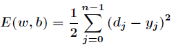

# 应用集成第三次作业报告

**利用机器学习的方法进行电影评分的预测**

+ 程翔 141250018
+ 陈之威 141250016
+ 崔浩 141250019
+ 陈天歌 141250014
+ 陈丹妮 141250008

## 数据

我们采用selenium+chromedriver+WebDriverManager，利用网页自动化测试工具爬取网页，根据所需元素的xpath与id获得元素内容。

解决问题：

1. 使用Selenium WebDriver 爬取数据时，在网络不好等情况下会无法加载页面
解决：为WebDriver 设置合适的超时时间，如果超时就抛出异常，捕获异常后重新发送请求。

2. WebDriver获取到页面后，在网络不好等情况时页面js加载速度比代码运行速度慢，可能导致获取不到完整的数据，使后续处理出现数组越界等错误。
解决：在几个关键的地方，如数组操作等地方捕获异常，如果出现上述情况就重新获取该页面的元素（数据）。

3. 部分电影链接失效 
解决：跳过失效电影

4. 部分电影片长不存在
解决：将不存在的电影片长设置为默认0

5. 部分电影片长为分钟+秒，部分电影信息为m集，每集n分钟
解决：计算总时长，只取分钟部分

6. 部分电影片长有多个版本
解决：取发行版本

最终，我们从豆瓣网上合计爬取到15875部电影数据，具体信息如下：

+ 年份信息
从1888年到2017年，其中，2011年电影数量最多，为892部，最少为1部

+ 导演
共7984位不同的导演，其中，最多的是王晶76部

+ 地区
共112个不同的国家或地区，其中最多为美国5462部

广大的训练数据集是产生预期结果的基础

## 训练方法

我们采用Back Propagation Neural Network，即BP神经网络为基础来进行训练。BP神经网络分为两个过程

1. 工作信号正向传递子过程
2. 误差信号反向传递子过程

*说明：以下公式参考了[Encog](http://www.heatonresearch.com/encog/)主页以及[Backpropagation wiki](https://en.wikipedia.org/wiki/Backpropagation)*

在BP神经网络中，单个样本有个输入，有个输出，在输入层和输出层之间通常还有若干个隐含层。大体上，一个三层的BP网络就可以完成任意的维到维的映射。即这三层分别是输入层（I），隐含层（H），输出层（O）。如下图示

**正向传播过程**

现在设节点i和节点j之间的权值为Wij，节点的阀值为bj，每个节点的输出值为xj，而每个节点的输出值是根据上层所有节点的输出值、当前节点与上一层所有节点的权值和当前节点的阀值还有激活函数来实现的。

 
**反向传播过程**

在BP神经网络中，误差信号反向传递子过程比较复杂，它是基于Widrow-Hoff学习规则的。假设输出层的所有结果为dj，误差函数为

 
而BP神经网络的主要目的是反复修正权值和阀值，使得误差函数值达到最小。Widrow-Hoff学习规则是通过沿着相对误差平方和的最速下降方向，连续调整网络的权值和阀值，根据梯度下降法，权值矢量的修正正比于当前位置上E(w,b)的梯度，对于第j个输出节点有
 

  
而针对输入层和隐含层和隐含层的阀值调整量的计算更为复杂。假设是输入层第k个节点和隐含层第i个节点之间的权值，那么有

     
 
有了上述公式，根据梯度下降法，那么对于隐含层和输出层之间的权值和阀值调整如下
 

**解决问题**

+ 根据那些指标进行合理的电影评分预测

>解决：经过开会与讨论，我们根据个人习惯以及调查，选取了电影导演、上映国家、上映年份、评分人数、影片时长作为电影指标，以这些指标预测一部电影的最终评分。为保证指标的统一性，我们同一以中国大陆版本为主，并选取了豆瓣作为数据来源平台，确保指标的合理性与一致性。

+ 各个指标的形式不同，比如导演、上映国家是枚举类型数据，而上映年份、评分人数、影片时长是数值型数据，如何将这些指标处理成机器学习可用性数据

>解决：对于数值型指标，我们选取该类型数值的最大值max以及最小值min，再通过（x-min）/(max-min)将该数值归一化；对于枚举型指标，我们统计了每个类型指标的评分之和，再将计算其和占总评分的比重，从而将数据归一化；对于评分，我们将评分除以10（评分范围在0~10之间），从而得到归一化的评分。

+ 具体参数和训练次数

>解决：经过多次尝试与比较，我们最终选定了一组效果较为好的参数，具体参数范围以及取值在代码BPNN.java中

## 测试结果

我们利用14000部电影作为训练数据，之后针对100部不在数据中的电影进行测试并统计，有

100部电影的预测值的方差为**272.78535915043875
**

部分检验电影的预测结果

## 影响分析

我们逐个改变影响因子的取值，来判断它对于模型的影响，结果如下

        开始敏感度计算
        数据顺序：导演（String）、国家（String）、上映年份（int）、评分人数（double）、片长（double）、评分（double）
        =================================================
        评分对第0个指标的敏感程度（其余指标为0）
        Input: 0.0; output: 5.9752206443800215
        Input: 0.1; output: 5.989591684670299
        Input: 0.2; output: 6.004708331485538
        Input: 0.3; output: 6.026369107799835
        Input: 0.4; output: 6.064634032660024
        Input: 0.5; output: 6.138626256016312
        Input: 0.6; output: 6.285187595695812
        Input: 0.7; output: 6.572086969392528
        Input: 0.8; output: 7.105690855564797
        Input: 0.9; output: 7.974812459434384
        Input: 1.0; output: 9.01592914082847
        =================================================
        评分对第1个指标的敏感程度（其余指标为0）
        Input: 0.0; output: 5.9752206443800215
        Input: 0.1; output: 5.9782284757683035
        Input: 0.2; output: 5.980935222214079
        Input: 0.3; output: 5.983371219714796
        Input: 0.4; output: 5.985563803468814
        Input: 0.5; output: 5.987717964549793
        Input: 0.6; output: 5.989495105548137
        Input: 0.7; output: 5.99109557919666
        Input: 0.8; output: 5.99253734048662
        Input: 0.9; output: 5.993836541767172
        Input: 1.0; output: 5.995007710366779
        =================================================
        评分对第2个指标的敏感程度（其余指标为0）
        Input: 0.0; output: 5.9752206443800215
        Input: 0.1; output: 1.972705465267174
        Input: 0.2; output: 1.9688333228421875
        Input: 0.3; output: 1.9718705096915983
        Input: 0.4; output: 1.9764728980766098
        Input: 0.5; output: 1.983450499769668
        Input: 0.6; output: 1.9940372757270495
        Input: 0.7; output: 2.0101186039534658
        Input: 0.8; output: 2.034588065233685
        Input: 0.9; output: 2.071915016160028
        Input: 1.0; output: 2.129063925205533
        =================================================
        评分对第3个指标的敏感程度（其余指标为0）
        Input: 0.0; output: 5.9752206443800215
        Input: 0.1; output: 5.984007236898144
        Input: 0.2; output: 5.9904967423275055
        Input: 0.3; output: 5.995363143690014
        Input: 0.4; output: 5.999094585011813
        Input: 0.5; output: 6.002045031548938
        Input: 0.6; output: 6.004472115378137
        Input: 0.7; output: 6.006564678399813
        Input: 0.8; output: 6.008462737189882
        Input: 0.9; output: 6.010271927055327
        Input: 1.0; output: 6.012073952272827
        =================================================
        评分对第4个指标的敏感程度（其余指标为0）
        Input: 0.0; output: 5.9752206443800215
        Input: 0.1; output: 5.973910761365885
        Input: 0.2; output: 5.972539727868064
        Input: 0.3; output: 5.971104770778693
        Input: 0.4; output: 5.969602994955018
        Input: 0.5; output: 5.968031378172998
        Input: 0.6; output: 5.966386765903416
        Input: 0.7; output: 5.96466586590747
        Input: 0.8; output: 5.962865242649079
        Input: 0.9; output: 5.9609813115215315
        Input: 1.0; output: 5.9590103328865744
        =================================================
        完成敏感度计算

从结果中我们可以看出，导演对于评分的影响最大，说明好的导演是一部优秀电影必不可少的因素，而片长则对于电影的影响最小，因此不能单单从影片的长短来判断其质量的高低；这两条结论也与我们日常生活中的常识一致